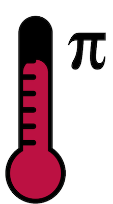

----
Information for using **plot.ly**:

You have to install the plot.ly python package first. For instruction see https://plot.ly/api/. 

Then, in the `update_plotly.py` file fill in your username and api key!

The plot.ly graph can also be embed in your website by using the following code (just replace the plot.ly link):

    <iframe id="igraph" src="https://plot.ly/~jensb89/12/400/250/" width="400" height="250" seamless="seamless" scrolling="no"></iframe>
----

	

#PiTemp

A simple script that monitors your Raspberry Pi's temperature.
Check out the [Trello Board for this project](https://trello.com/b/qVO2xuEq/open-source-pitemp)

----

##Installation

Before you can start monitoring your Pis temperature in your webbrowser you need to install a webserver with PHP. I use a LAMP setup. Follow one of the many guides like [this](http://www.dingleberrypi.com/2012/09/tutorial-install-apache-php-and-mysql-on-raspberry-pi/) or [this one](http://www.wikihow.com/Make-a-Raspberry-Pi-Web-Server) to setup your Raspberry Pi as a webserver. 

If you have git installed on your Raspberry you can easily clone the repo into the webroot of your webserver. 

	// Example is for apache only. 
	// Replace /var/www/ with the webroot of your webserver
	cd /var/www
	git clone https://github.com/fechu/PiTemp
	
The next thing to do is to setup cron to execute the `monitor.php` script every 15 minutes to write down the temperature. You do this by modifing the file `/etc/crontab` like this:

	sudo nano /etc/crontab

Add the following line to the end of the file.

	*/15 *  * * *   root    /var/www/PiTemp/monitor.php
	
This tells cron to execute the script every 15 minutes of an hour. `root` is the user that executes the script. and `/var/www/PiTemp/monitor.php` is the script that is executed.

That's it! Now you need to wait for your script to collect the data. 

As soon as you can't wait anymore, just open your browser (the computer has to be connected to the same network as the Raspberry Pi) and navigate to `http://<Your Pi's IP>/PiTemp`.

##Configuration

You can find all configuration options in the `config.php` file. Have a look at it. Everything is directly documented in the `config.php` file. 

###Override Configuration
In case you want to override the configuration but keep it easy to update PiTemp with a `git pull`, you can copy the `config.php` file and name it `local.config.php`. This file will then be ignored by git but merged with the `config.php`. This way you the `config.php` file stays untouched.

###Email Notification
Since version 0.1.0 there's support for email notification. You can define a maximum temperature in the `config.php` (or `local.config.php`) file. If the temperature raises above this level, you receive an email notification to the configured address.

The configuration of email notification is not that hard once you've configured your Raspberry Pi to send emails. However, this can be a little bit tricky. Use one of the many tutorials out there in the world wide web. I used [this one](http://www.dingleberrypi.com/2012/09/tutorial-install-postfix-to-allow-outgoing-email-on-raspberry-pi/) to set `postfix` up. You just have to make the PHP `mail()` function work.

###Pushover Notification
Since version 0.2.0 there's support for [Pushover](http://pushover.net) notification. If you want to use this feature, make sure you have the `cURL` extension for PHP installed. You can do so by executing the following commands: 

	sudo apt-get install php5-curl

The next (and last) thing you have to do is insert your Pushover userkey in your `config.php`/`local.config.php` file. 

###Pushbullet Notification
Since version 0.3.0 there's support for [Pushbullet](https://www.pushbullet.com). If you want to use this feature you just have to drop in your API Key and Device ID into the `config`/`local.config.php` file. 

##Todo

- Support F&deg; & C&deg; in notifications
- Support multiple Raspberry Pi
- Select timespan
- Use Sqlite/Mysql database instead of textfile
- Add possibility to test notifications
- Add support for hostname/IPAddress in Pushover notification

Check out the [Trello Board for this project](https://trello.com/b/qVO2xuEq/open-source-pitemp)

##Libraries

This project uses the following libraries or parts of them:

- Flot ([flotcharts.org](http://www.flotcharts.org)) Released under [MIT License](http://opensource.org/licenses/MIT)
- Twitter Bootstrap ([twitter.github.io/bootstrap/](https://twitter.github.io/bootstrap)) Released under [Apache License Version 2.0](http://www.apache.org/licenses/LICENSE-2.0)
- jQuery ([jquery.com](http://jquery.com)) Released under [MIT License](http://opensource.org/licenses/MIT)

##Contributors

- [Litschi](https://github.com/Litschi) Created the awesome Logo!
- [elpatron68](https://github.com/elpatron68) Added the Pushbullet support
- [fechu](https://github.com/fechu) Yep. That's me!

##License

The MIT License (MIT)

Copyright (c) 2013 Sandro Meier

Permission is hereby granted, free of charge, to any person obtaining a copy
of this software and associated documentation files (the "Software"), to deal
in the Software without restriction, including without limitation the rights
to use, copy, modify, merge, publish, distribute, sublicense, and/or sell
copies of the Software, and to permit persons to whom the Software is
furnished to do so, subject to the following conditions:

The above copyright notice and this permission notice shall be included in
all copies or substantial portions of the Software.

THE SOFTWARE IS PROVIDED "AS IS", WITHOUT WARRANTY OF ANY KIND, EXPRESS OR
IMPLIED, INCLUDING BUT NOT LIMITED TO THE WARRANTIES OF MERCHANTABILITY,
FITNESS FOR A PARTICULAR PURPOSE AND NONINFRINGEMENT. IN NO EVENT SHALL THE
AUTHORS OR COPYRIGHT HOLDERS BE LIABLE FOR ANY CLAIM, DAMAGES OR OTHER
LIABILITY, WHETHER IN AN ACTION OF CONTRACT, TORT OR OTHERWISE, ARISING FROM,
OUT OF OR IN CONNECTION WITH THE SOFTWARE OR THE USE OR OTHER DEALINGS IN
THE SOFTWARE.
